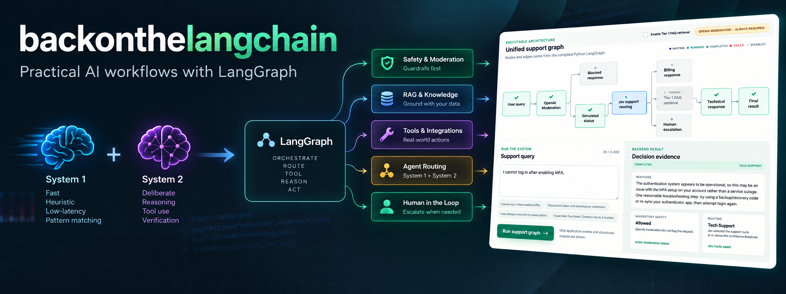

<p align="center">
  
</p>

# backonthelangchain

`backonthelangchain` is an observable prototype of a combined AI billing and IT
support workflow. It connects mandatory safety, simulated system evidence,
fast classification, retrieval, and response generation in one inspectable
LangGraph application, and automatically identifies requests that may need
human intervention.

System 1-style calls are fast and inexpensive for frequent classification and
routing decisions, while System 2-style models trade more time and cost for
deeper reasoning and stronger generated responses. RAG injects domain-specific
knowledge at request time, as the experiments below demonstrate. The unified
application is organized like a real support workflow so a run can be tested
and debugged from its structured inputs, decisions, evidence, route, and
output.

## Python-only quick start

Yes, the project works without the GUI or a running FastAPI server, and the
command-line examples do not require Node.js. The shortest path runs the
safety-gated support router from a terminal.

Requirements: Python 3.10 through 3.13, Poetry, and an OpenAI API key.

```bash
poetry install
cp .env.example .env
```

Set `OPENAI_API_KEY` in the local `.env` file, then run:

```bash
poetry run python examples/run_safe_support_router.py \
  "I cannot log in after enabling MFA."
```

The script runs OpenAI Moderation first, routes an allowed request to technical
or billing support, and prints the answer and safety result. Provider calls may
incur usage charges. Never commit the populated `.env` file.

Other terminal examples add Jev routing or RAG. See
[Python examples and dependencies](docs/development.md#python-examples).

## Web frontend quick start

The web application visualizes the full support graph, streams live node state,
and lets you select each completed node to inspect its application-level
contribution. In addition to the Python requirements, install Node.js 20.9 or
newer and npm.

Install the backend with the Jev integration:

```bash
poetry install -E jev
cp .env.example .env
```

Set these variables in `.env`:

```text
OPENAI_API_KEY
TYPESAFE_API_KEY
```

Start the backend from the repository root:

```bash
poetry run uvicorn backonthelangchain.api.app:app \
  --env-file .env --reload --host 127.0.0.1 --port 8000
```

In another terminal, start the frontend:

```bash
cd web
npm ci
npm run dev
```

Open [http://localhost:3000](http://localhost:3000). The Next.js server proxies
`/backend/*` to `http://127.0.0.1:8000/api/*` by default.

To use the optional FAQ retrieval stage, install both runtime extras before
starting the backend:

```bash
poetry install -E jev -E rag
```

The retrieval stage uses OpenAI embeddings and runs only for technical requests
when the option is enabled in the interface. Its bundled documents are clearly
labeled fictional demo knowledge.

## Try it

The web app lets you change parts of the workflow and watch what happens.

### Turn RAG on and off

Run the accounting workstation support query with RAG off. The response model
has its general knowledge and the other workflow context, but not the
organization-specific recovery procedure.

Now turn RAG on and run the same query. The retrieval step finds the fictional
**Accounting Workstation Recovery** document and injects its Acme Report Writer
procedure into the context used to generate the response. Open the RAG node to
see exactly what was retrieved.

This demonstrates a common reason for RAG: giving an LLM knowledge specific to
an organization or application without retraining the model.

### Change the system state

Set Checkout to Operational, Degraded, and Outage in turn, then submit the same
report that checkout is down. The user's message alone is a claim. The System
Status stage gives the workflow another source of evidence, allowing the run to
record whether the claim is contradicted, partially corroborated, or
corroborated.

The current status is simulated, but the same node could later query a
monitoring system, status API, or MCP tool. It is demo evidence, not real
monitoring data.

### Watch Jev make the decision

Try an ordinary support request, repeated failed troubleshooting, a critical
outage, and an explicit request for a human. Jev produces routing and
escalation scores that determine where the workflow goes next.

This demonstrates using a small, specialized model for fast and inexpensive
decisions while reserving the larger generative model for tasks that benefit
from generation and deeper language understanding. The UI exposes Jev's
scores, the configured `0.80` escalation threshold, and whether that threshold
was met, so you can see when the classifier gets the decision right and when it
does not.

### Follow the graph

The graph is the application. As a request runs, watch execution move through:

```text
Moderation -> System Status -> Jev -> RAG -> Response -> Final Result
```

Select a completed node to see what information that stage received or
produced. At the end, **What happened?** summarizes:

- which path executed
- what system evidence was available
- how Jev routed the request
- what RAG retrieved
- what context reached the response model
- whether human escalation was triggered
- how the final response was produced

This makes it possible to inspect the behavior of the complete AI system
instead of seeing only the final LLM response.

## Why combine these approaches?

A production AI application does not have to choose between traditional
software, specialized models, retrieval, tools, and large language models.
They can complement one another. This project is a sandbox for experimenting
with where each approach works well, where it fails, and how changing one part
affects the rest of the workflow.

Every completed run includes a deterministic "What happened?" summary and
final-result provenance. Both are derived from structured stage evidence. No
model is asked to explain its hidden reasoning, and the API never exposes
prompts, chain-of-thought, raw provider objects, credentials, request headers,
private reasoning tokens, stack traces, or sensitive internal errors.

The focused command-line examples remain independent teaching paths. The web
application centers the unified graph and does not present an example catalog.

## Documentation

- [Architecture](docs/architecture.md): graph flow, live events, status
  evidence, optional retrieval, and frontend/backend boundaries
- [API reference](docs/api.md): endpoints, request shapes, streaming events,
  limits, and compatibility routes
- [Security and deployment](docs/security-and-deployment.md): current
  protections, safety limitations, and production requirements
- [Development](docs/development.md): example matrix, optional dependencies,
  project layout, and validation commands

## License

No license file is currently included. Treat the repository as source-available
for inspection until the project owner adds explicit license terms.
